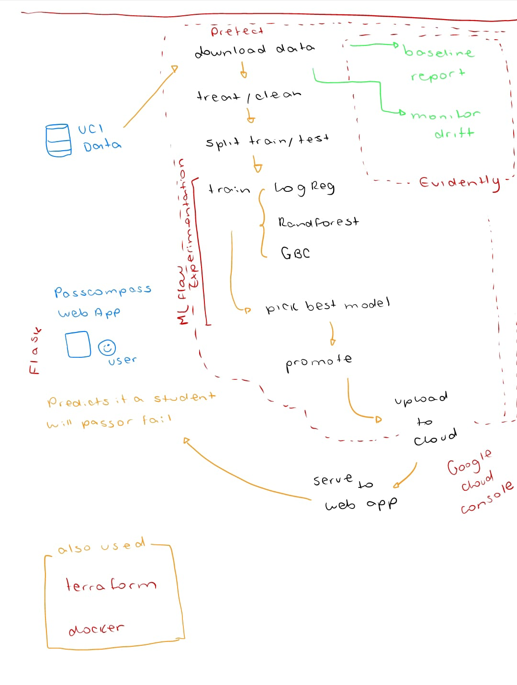
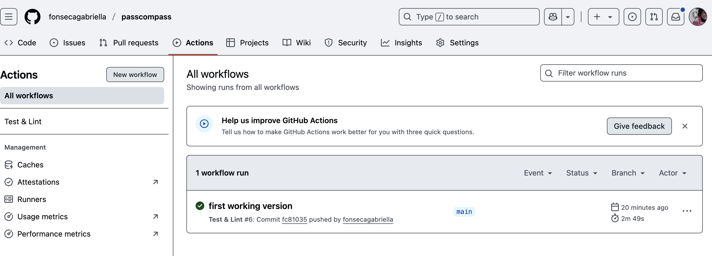

# PassCompass 🧭 ✅ 

***MLOps Project | Spotting at-risk students before grades slip, guiding learners toward success.***

Passcompass delivers an end-to-end, monitored pipeline (data ingest → training → deployment → drift alerts) that showcases modern **MLOps practices** and creates a tool that can be adapted by real schools with only spreadsheet-level infrastructure.

- Presented as the final project for [MLops Zoomcamp, 2025](https://github.com/DataTalksClub/mlops-zoomcamp)*
- For MlOpsZoomcamps evaluators: *I hope you learned as much as I did! 😅 Here you can find the [Criteria list](#-for-mlops-zoomcamp-classmates-evaluation-criteria).


## 👀 Problem
Each semester, thousands of students silently accumulate risk factors, including poor attendance, high failure rates, and limited study time. These factors can culminate in course failure or dropping out. Most schools still rely on end-of-term grades to identify struggling students, when intervention is already too late.

## ⭐️ Goal
Build a lightweight, open-source prediction web service that flags students with a high probability of failing a course early in the term, so teachers, counsellors, or mentoring programmes can intervene with targeted support (extra coaching, social-emotional resources, family outreach).


### 👍 Social relevance

| Angle                     | Why it matters                                                                                                                                                                |
| ------------------------- | ----------------------------------------------------------------------------------------------------------------------------------------------------------------------------- |
| **Equity & inclusion**    | Low-income and first-generation learners are over-represented among repeaters. Early alerts help close attainment gaps.                                                       |
| **Drop-out prevention**   | Each prevented failure boosts persistence rates, reducing long-term economic costs for both students and institutions.                                                        |
| **Resource optimisation** | Schools can triage scarce tutoring budgets toward the highest-risk cohort instead of blanket remediation.                                                                     |

## 👩🏽‍💻 The dataset

- [UCI Student Performance](https://archive.ics.uci.edu/dataset/320/student%2Bperformance)
- [Dataset schema](./_exploration/dataset_schema.md)

Collected via questionnaires and school reports at two Portuguese secondary schools, this dataset captures socioeconomic, family and study-habit factors alongside three period grades (G1–G3) for 649 students in Mathematics and Portuguese language. It has become a staple benchmark for early-warning systems in education because it is small, tidy and publicly licensed, yet rich enough to test fairness and feature-drift monitoring strategies. They convert the final grade G3 into a binary pass (≥ 10) / fail target to align with real-world intervention workflows.


## 🔄 Flow diagram
```
┌────────────────────────┐
│   UCI Student CSVs     │
│  (Math & Portuguese)   │
└────────────┬───────────┘
             │  Prefect flow: download
             ▼
┌────────────────────────┐
│  Data Cleaning & EDA   │
│  • join courses        │
│  • engineer target     │
└────────────┬───────────┘
             │  Prefect flow: train with experimentation
             ▼
┌────────────────────────┐
│  MLflow Experiment     │
│  • logistic regression │
│  • random forest       │
│  • gbc                 │
└────────────┬───────────┘
             │  registers best model in MLflow Registry
             ▼
┌────────────────────────┐
│  Docker Image Build    │
│  (GitHub Actions)      │
└────────────┬───────────┘
             │  push to GHCR
             ▼
┌───────────────────────────────┐
│  Flask API                    │
│  • POST /predict ↦ pass prob  │
│  • loads model from registry  │
└────────────┬──────────────────┘
             │  JSON request/response
             ▼
       ┌──────────────┐
       │  End Users   │
       │  (teachers)  │
       └──────────────┘
             ▲
             │  logs inferences
┌────────────┴──────────────────┐
│      Evidently Monitoring     │
│  • drift & accuracy reports   │
│  • Prefect alert → Slack      │
└───────────────────────────────┘
```

**Infra notes:**
- Terraform (not shown) provisions a small CPU VM + object storage bucket.
- CI/CD: GitHub Actions lints, tests, builds the Docker image, and redeploys the FastAPI container on success.
- Pytests (unit and deployment)



-------


## 🏃🏽‍♀️ How to run

You can follow [detailed instructions here](./how_to_run.md).

-------

## 📚 (For MLOps Zoomcamp classmates) Evaluation criteria

**Problem description**
-  ✅ 2 points: The problem is well described and it's clear what the problem the project solves
*I hope this document is clear enough* 👩🏽‍💻 ❤️

**Cloud**
- ✅ 4 points: The project is developed on the cloud and IaC tools are used for provisioning the infrastructure
*The project can be run partially on the cloud and IaC is used, check [here](./how_to_run.md#cloud)*.

**Experiment tracking and model registry**
- ✅ 4 points: Both experiment tracking and model registry are used
*You can find instructions [here](./how_to_run.md#mlflow*.

**Workflow orchestration**
- ✅ 4 points: Fully deployed workflow
*The flow is available [here as a diagram](#flow-diagram) and here as [instructions on how to run it](./how_to_run.md)

**Model deployment**
- ✅ 4 points: The model deployment code is containerized and could be deployed to cloud or special tools for model deployment are used
*The model is containerized. You can check the [dockerfile](./Dockerfile) or more instructions about the model [here](./how_to_run.md#webapp-docker)*

**Model monitoring**
- 2 points: Basic model monitoring that calculates and reports metrics

**Reproducibility**
- ✅ 4 points: Instructions are clear, it's easy to run the code, and it works. The versions for all the dependencies are specified.
*[This document](./how_to_run.md) containts detailed instructions on how to duplicate and run this project both locally and in the cloud (GCS)*

**Best practices**
- ✅ There are unit tests (1 point)
      - *The list of current unit tests can be found [here](./how_to_run.md#unit-tests)*

- ✅  There is an integration test (1 point)
      - *The list of current integration tests can be found [here](./how_to_run.md#integration-tests)*

- ✅ Linter and/or code formatter are used (1 point)
      - *Linter+Black are used, instructions can be found [here](./how_to_run.md#code-format)*

- ✅  There's a Makefile (1 point)code-format
      - *It can be found [here](./Makefile)*

- ✅ There are pre-commit hooks (1 point)
      - *They can be checked @ [Github actions](https://github.com/fonsecagabriella/passcompass/actions)*
      

- ✅  There's a CI/CD pipeline (2 points)
      - *[Lint + Tests workflow](./.github/workflows/lint.yml) runs in CI*
      - *CI/CD is handled by GitHub Actions. Every push or pull-request triggers the workflow in `.github/workflows/ci.yml`, which runs Black, Ruff and pytest; a green build on main auto-publishes the Docker image to GitHub Container Registry.*
      - You can check [here](./how_to_run.md#webapp-git) for how to run the webapp from the latest deployed image.


## 🧐 For the future

Some ideas for future exploration [are listed here](./_exploration/fixes.md).

This project’s primary objective was to showcase how to *blend disciplined machine-learning experimentation with solid engineering and MLOps practices*. Deep, model-centric explorations were kept intentionally minimal—apart from a lightweight Hyperopt search used to establish a baseline—so that the spotlight remains on the end-to-end pipeline.

---

Do you have any feedback, comments or want to work together? `hello@imgabi.com` 👩🏽‍💻