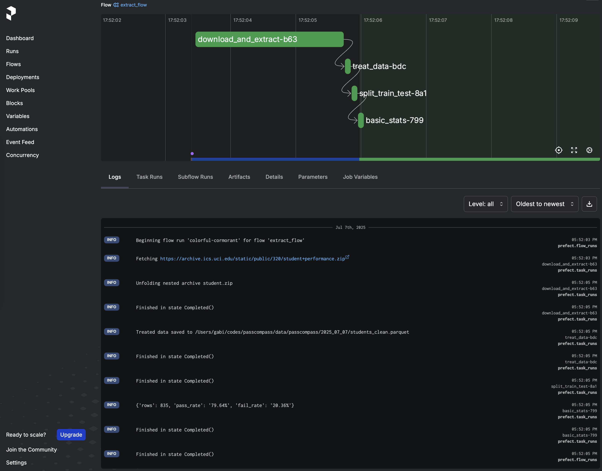
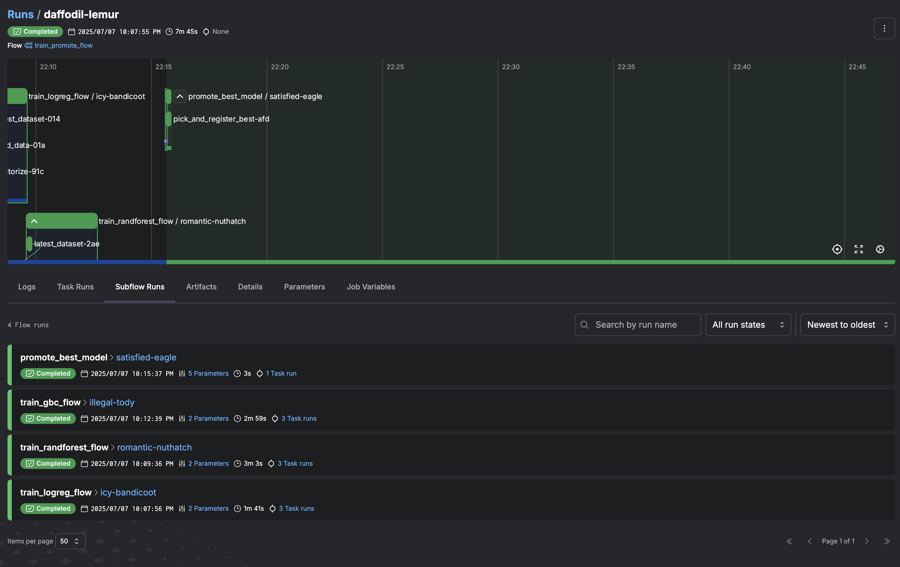
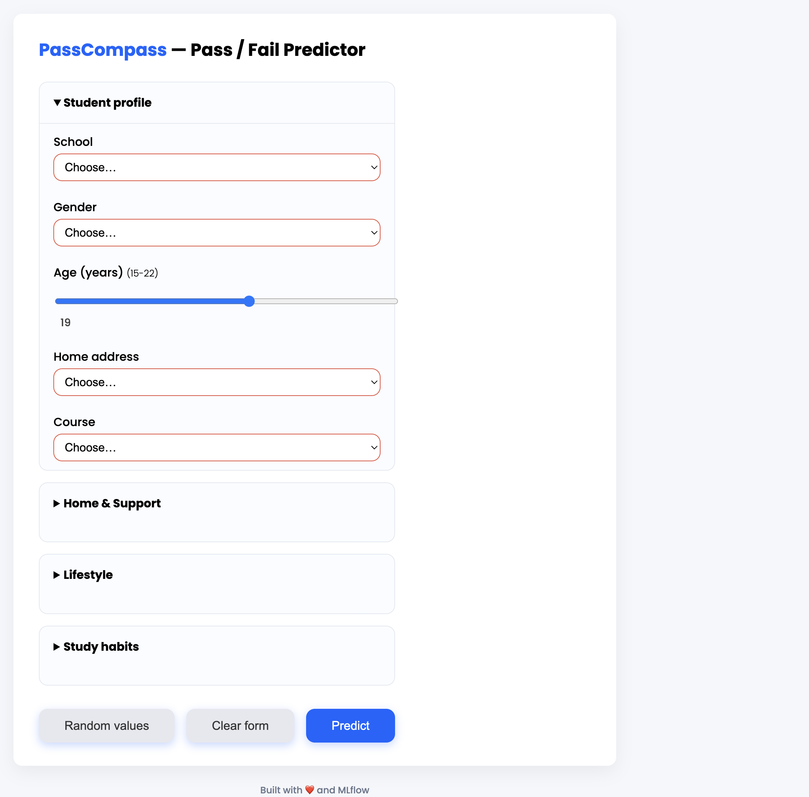
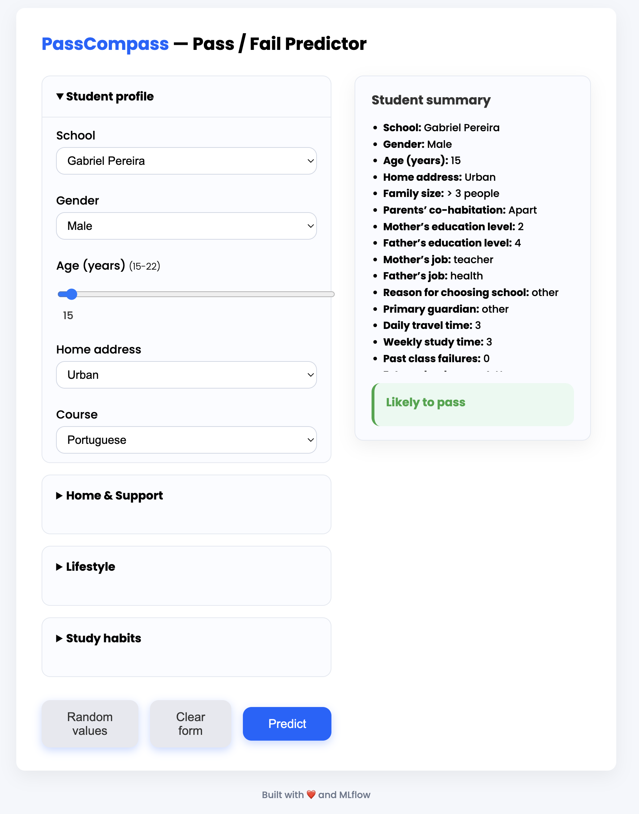
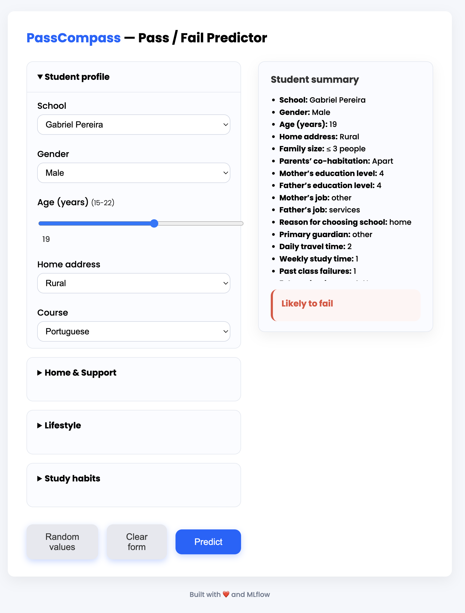
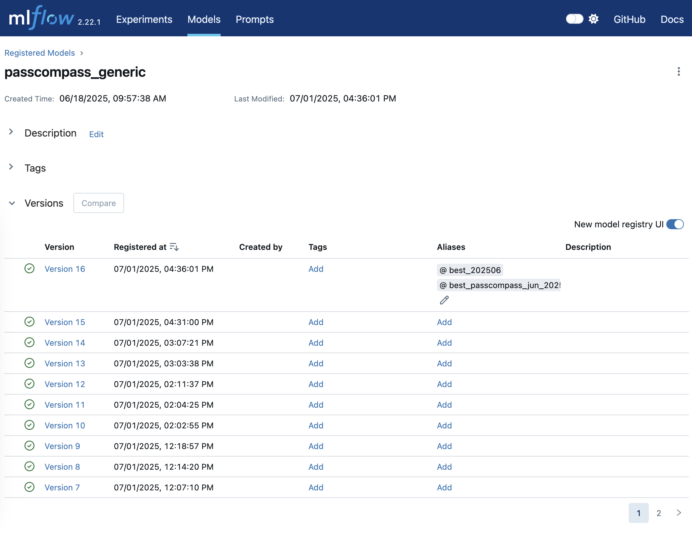

# 🛠️ Project Setup Guide

This guide outlines how to set up and run the project from scratch. The setup includes provisioning cloud infrastructure with Terraform, deploying the model API, and preparing for end-to-end machine learning operations.


## Folder structure

```

PASSCOMPASS/
│
├── 00_exploration/              # notebooks to get familiar with dataset
|                                
│
├── **01_pipelines/**             # code that Prefect will call
│   ├── **evidently_pipeline**    # basic monitoring with Evidently
│   ├── **promotion_pipeline**    # log + register model
│   └── **training_pipeline**     # train models with experimentation
│   └── **00_extract_flow.py**    # run to download and treat data
│   └── **01_train_promote_flow.py**     # run to train model and promote best one
│
├── **artifacts/**               # where ml stores artifacts locally
│
├── **data/**                    # where data is stored locally
│
├── **imgs/**                    
│  
├── **infra/**                   # terraform files
│
├── **reports/**                 # reports from evidently
|
├── **src/**                     # utils to save different metrics for model comparision
|
├── **tests/**                   # a few tests
|
├── **webapp/**                  # flask web application with ui interface for singular prediction
|
├── **Makefile**                 # convenience targets
├── **environment.yml**          # include mlflow & prefect
├── **.env.example**             # env vars (ignored in .gitignore)
│
├── LICENSE
└── README.md

```

```bash
make env-create
make mlflow-ui          # open http://127.0.0.1:5000
make run-flow           # kicks off the Prefect pipeline
```


---

## 📦 Prerequisites

Make sure you have the following installed:

- [Python 3.8+](https://www.python.org/)
- [Terraform](https://developer.hashicorp.com/terraform/downloads)
- [Google Cloud SDK (`gcloud`)](https://cloud.google.com/sdk)
- Docker
- A Google Cloud Project (you will need the **project ID**)

---

## Notes
There are two options to run this project:
1. Local
2. Cloud (partially) 

You can set a local variable ENVIRONMENT as 

1. `local`
2. `gcs` (for google cloud console)

The Cloud setup is currently partial. This has been done intentionally due to the (time & budget) limitation of this project.
Data for traing is stored locally. In the cloud option, you can deploy the best model to the cloud in a bucket. Evidently reports are also stored on the bucket. 
Terraform is used to create the bucket.

--- 

## Instructions

### 0.0 Create a virtual machine
``` bash
make env-create
```

### 0.1 Set up local variables

``` bash
MLFLOW_TRACKING_URI=http://127.0.0.1:5001
MLFLOW_ARTIFACT_ROOT=./artifacts
PREFECT_API_URL=http://127.0.0.1:4200/api          # optional
PREFECT_SEND_ANONYMOUS_TELEMETRY=0
PYTHONPATH=${PYTHONPATH}:./src
MODEL_NAME=passcompass_generic
MODEL_ALIAS = "best_202506"
MODEL_STAGE=Staging 
MLFLOW_EXPERIMENT=passcompass_mlops
PREFECT__FLOWS__EXECUTION__DEFAULT_GIT_DESTINATION="~/prefect/git-storage" # edit path
ENVIRONMENT=local # local or gcs
GCS_BUCKET=gs://passcompass-ml-bucket # edit path
GCS_MODEL_URI=gs://passcompass-ml-bucket/model/passcompass_generic_v16 # edit path
GCS_DATA_URI=gs://passcompass-ml-bucket/data # edit path
LOCAL_DATA_URI=passcompass/data/passcompass # edit path
```

------

<div id="cloud"></div>

### 0.2 **(if `ENVIRONMENT=gcs`)** Set up Google Cloud Project 

1. Create a GCP project if you haven’t already.
2. Enable the following APIs:
   - Cloud Run
   - Cloud Storage
   - Artifact Registry
3. Authenticate with GCP CLI:
   ```bash
   gcloud auth application-default login
   ```

### 0.2.1 Provision Infrastructure with Terraform

1. Navigate to the `infra/` directory: `cd infra`

2. Create a `terraform.tfvars` file to pass in your project ID:

3. Initiliase and apply terraform

```bash
terraform init
terraform apply -var-file="terraform.tfvars"
```

**✅ What this step does**
- Creates a GCS bucket: passcompass-ml-bucket
- Simulates two folder paths by adding empty .keep files:
    - model/
    - data/

### 0.3 Run MLflow & Prefect Server locally

```bash
make prefect-ui
make prefect-dashboard
make mlflow-ui

```

### 1.0 Run Prefect flows

1. Extract data
`make extract-flow`
Ps: You can comment out lines of the main function to register a CRON deployment. 



2. Train and promote model
`make train-promote-flow`



3. Run web application and try a prediction
`make webapp-dev`

You can navigate to: `http://127.0.0.1:8000/`





<div id="webapp-docker"></div>

4. Optional - Run the web application in a docker container

First build the [dockerfile](./Dockerfile):

`docker build -t passcompass:1.0 .`

Next, run the container.
Note: you have to adapt the -v below with the full path folder in your location.

```bash
docker run \
  -p 8080:8080 \
  -e MLFLOW_TRACKING_URI="http://host.docker.internal:5001" \
  -v "/Users/gabi/codes/passcompass/artifacts:/Users/gabi/codes/passcompass/artifacts" \
  passcompass:1.0
```

🚨 6. Draft Evidently flow simple one


------

### 2.0 Check the services

<div id="unit-tests"></div>

#### Mlflow model registery

You can access MlFlow locally at `http://127.0.0.1:5001/`.
From the UI, click in `models` to follow the model registry.



#### Prefect dashboards

You can access Prefect locally at `http://127.0.0.1:4200/dashboard`.

------

### 3.0 Unit tests
Run unit tests anytime with
`pytest -q`

**Currently implemented tests:**
- [Test 01: Extract Flow](./tests/test_extract_flow.py)
After running the `download_and_extract` task, does the file system contain at least the files that have just been un-zipped?
`pytest -q tests/test_extract_flow.py`

For the future:
- Does the model get one basic prediction right?
- Does mlflow return a model?
- Does the “promote best model” helper pick the right run?
- Can the Flask endpoint answer a happy-path request?
- Is the monitoring flow with Evidently at least able to run end-to-end?

------

<div id="integration-tests"></div>

### 4.0 Integration tests
**Currently implemented tests:**
- [Test 01: Extract Integration](./tests/test_extract_integration.py)
Minimal “happy-path” integration test that runs the whole
extract_flow Prefect flow (download ➜ clean ➜ split ➜ stats) against a fake ZIP file served from memory.
`pytest -q tests/test_extract_integration.py`


For the future:
- . Train → Promote happy path
- Failing download → graceful error
- After a train flow completes, open the MLflow run and assert it logged all expected metrics & params

------
<div id="code-format"></div>

 ### 5.0 Code style & quality checks

| Tool | Role | How to run it manually |
|------|------|------------------------|
| [**Black**](https://black.readthedocs.io/) | Opinionated code formatter | `black .` |
| [**Ruff**](https://docs.astral.sh/ruff/)  | Linter (+ import-sorter & quick-fixes) | `ruff check --fix .` |

- Both tools read their configuration from [`pyproject.toml`](./pyproject.toml).
- A **pre-commit** hook runs `black --check` and `ruff --fix` on every `git commit`.

- Install once with: `pre-commit install`
- You can skip a hook once with: `git commit -m "msg" --no-verify`
- You can check the files before commit with: `pre-commit run --all-files`

The same checks run in CI (.github/workflows/lint.yml) to guarantee every PR stays style-clean.

------

<div id="webapp-git">

### 6.0 Running the web application from latest published image

- Pull the image
`docker pull ghcr.io/fonsecagabriella/passcompass-web:latest`

- Run the image
```bash
docker run \
  -p 8080:8080 \
  -e MLFLOW_TRACKING_URI="http://host.docker.internal:5001" \
  -v "/Users/gabi/codes/passcompass/artifacts:/app/artifacts" \
  ghcr.io/fonsecagabriella/passcompass-web:latest
```

The image is deployed everytime a new commit passed the tests.
You might need to updated the location -v of where the artifacts folder exists.